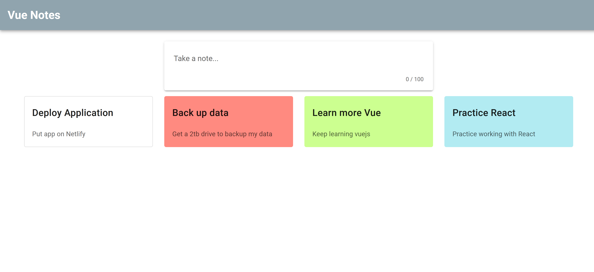

# Vue Notes

- A site that is based off of Keep, Google's note-taking application. A user can jot down notes to serve as reminders. Notes possess total CRUD functionality.

---

##### Deployed Application:

https://vue-notes01.netlify.app

---

---

##### Technologies Used:

- Vue
- Vuex
- Vuetify
- Firebase

---

##### Author

Keaton Sentak - [Portfolio](https://keatonsentak.dev) | [GitHub](https://github.com/ksentak)
